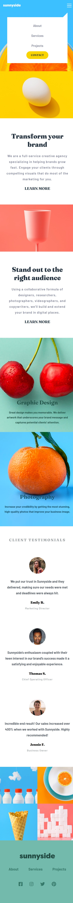

# Frontend Mentor - Sunnyside agency landing page solution

This is a solution to the [Sunnyside agency landing page challenge on Frontend Mentor](https://www.frontendmentor.io/challenges/sunnyside-agency-landing-page-7yVs3B6ef). Frontend Mentor challenges help you improve your coding skills by building realistic projects.

## Overview

### Screenshot

### Links

- Solution URL: [My solution](https://github.com/wojtekqwe/sunnyside_agency_landing_page)
- Live Site URL: [My live site URL](https://wojtekqwe.github.io/sunnyside_agency_landing_page)

## My process

### Built with

- HTML5
- SCSS
- Flexbox
- CSS Grid
- Mobile-first workflow
- JavaScript
